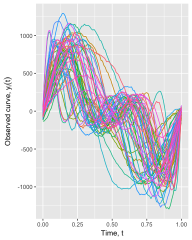
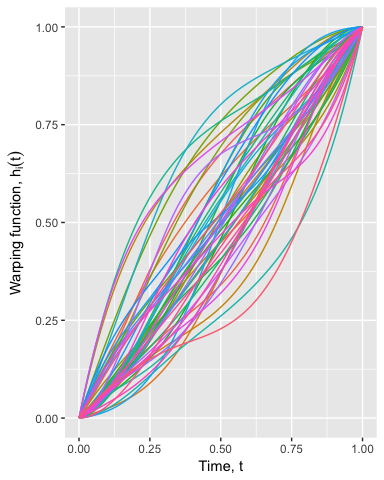
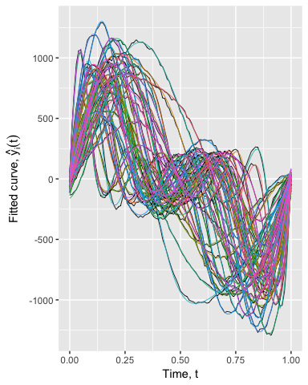
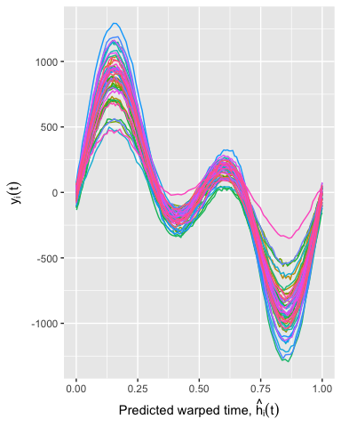
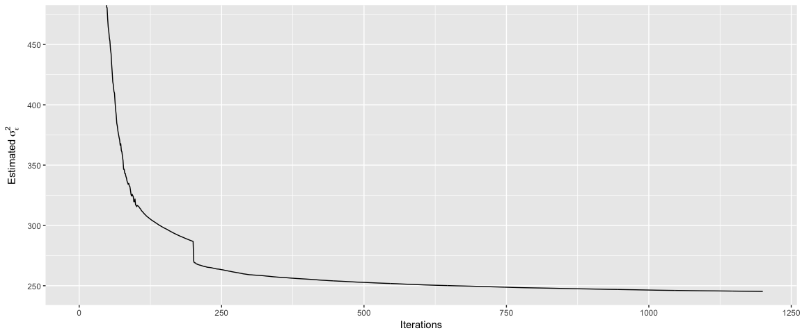
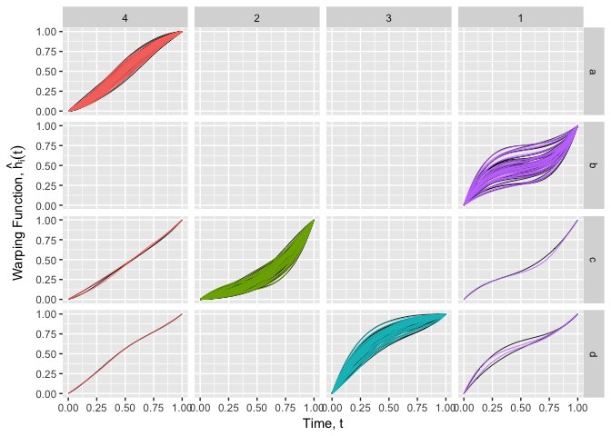
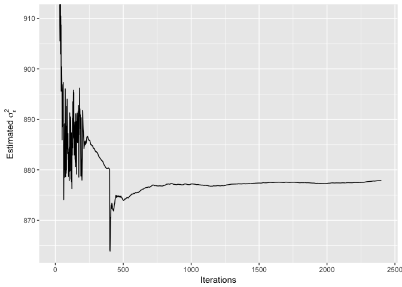
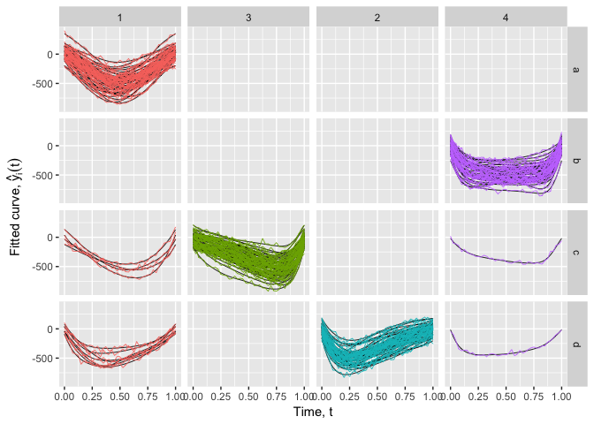
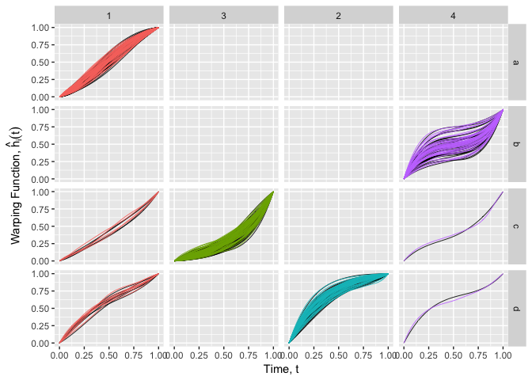
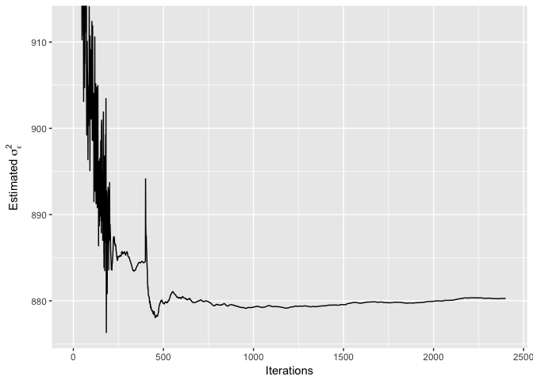

R package: mixedWarpedCurves2
================

-   [Installation](#installation)
-   [Model](#model)
-   [Example 1: Curve registration](#example-1-curve-registration)
-   [Example 2: Clustering on phase variation](#example-2-clustering-on-phase-variation)
-   [Reference](#reference)

Installation
============

To install the latest version:

    library(devtools)
    devtools::install_github('eric-f/mixedWarpedCurves2')

Model
=====

We model the functional data as noisy observations of latent curves, 's, at time , as  + \epsilon_{ij}.")

The latent curve,  = f_i \circ h_i(t),") is composed of two functions,  and , representing amplitude and phase variations. Specifically, the amplitude function is rank-1: "), with a common base shape  whereas the warping function ![h\_i:\[0, 1\]\\to\[0, 1\]](https://latex.codecogs.com/png.latex?h_i%3A%5B0%2C%201%5D%5Cto%5B0%2C%201%5D "h_i:[0, 1]\to[0, 1]") is continuous and strictly increasing.

Amplitude function
------------------

The base shape,  is either a known function or modelled as a spline that is to be estimated. The amplitude random effect, "), is Gaussian with mean ") and variance-covariance matrix .

`fsim_unimodal()` fit the fixed base shape version where  = -4t(1-t)").

`fsim_mixed_warped_curves()` fit the unknown base shape version of the model. The base shape is modelled using B-spline basis. The order and knot locations of the spline are specified via the options `f_order` and `f_knots` in `control_saem()`.

Warping function
----------------

The warping function is modelled using B-spline basis,

 = \sum_{k=1}^{K_h} w_{i,k}B_k(t),")

 where . The first difference of the random coefficients, ,") follows a Dirichlet distribution whose mean is fixed such that )=t").

The order and knot locations of the spline are specified via the options `h_order` and `h_knots` in `control_saem()`.

Example 1: Curve registration
=============================



Estimate model parameters and warping functions by SAEM
-------------------------------------------------------

``` r
out <- fsim_mixed_warped_curves(
  y = sim_data$y,
  obs_time = sim_data$x,
  curve_id = sim_data$id,
  saem_control = control_saem(
    n_saem_iter = 1000,
    n_saem_burn = 100,
    n_mcmc_burn = 5,
    h_knots = seq(0, 1, length=5),
    f_knots = seq(0, 1, length=7)
  ))
```

    ## [1] "Randomizing initial cluster labels..."
    ## Import parameters...
    ## Generate Cholesky centering matrix...
    ## Import data...
    ## Initialize basis evaluation matrices...
    ## Entering SAEM loop...
    ## 0.0%...5.0%...Initialize clustering with user inputs...
    ## cluster_size
    ##    50.0000
    ## 
    ## p_clusters
    ##    1.0000
    ## 
    ## 10.0%...15.0%...20.0%...25.0%...30.0%...35.0%...40.0%...45.0%...50.0%...55.0%...60.0%...65.0%...70.0%...75.0%...80.0%...85.0%...90.0%...95.0%...(Done)

Fitted curves and registered curves
-----------------------------------





Example 2: Clustering on phase variation
========================================


Fit mixture of warping function by SAEM
---------------------------------------

### Known unimodal shape

``` r
clust_out <- fsim_unimodal(
  y = mix_data$y,
  obs_time = mix_data$x,
  curve_id = mix_data$id,
  n_clust = 4,
  saem_control = control_saem(
    n_saem_iter = 2000,
    n_saem_burn = 200,
    n_mcmc_burn = 5,
    h_knots = seq(0, 1, length=5)
  ))
```

    ## [1] "Randomizing initial cluster labels..."
    ## Entering SAEM loop...
    ## 0.0%...5.0%...Initialize clustering with user inputs...
    ## cluster_size
    ##    43.0000
    ##    53.0000
    ##    48.0000
    ##    56.0000
    ## 
    ## p_clusters
    ##    0.2150
    ##    0.2650
    ##    0.2400
    ##    0.2800
    ## 
    ## 10.0%...15.0%...20.0%...25.0%...30.0%...35.0%...40.0%...45.0%...50.0%...55.0%...60.0%...65.0%...70.0%...75.0%...80.0%...85.0%...90.0%...95.0%...(Done)

### Unknown base shape

``` r
flex_clust_out <- fsim_mixed_warped_curves(
  y = mix_data$y,
  obs_time = mix_data$x,
  curve_id = mix_data$id,
  n_clust = 4,
  saem_control = control_saem(
    n_saem_iter = 2000,
    n_saem_burn = 200,
    n_mcmc_burn = 5,
    h_knots = seq(0, 1, length=7),
    f_knots = seq(0, 1, length=3)
  ))
```

    ## [1] "Randomizing initial cluster labels..."
    ## Import parameters...
    ## Generate Cholesky centering matrix...
    ## Import data...
    ## Initialize basis evaluation matrices...
    ## Entering SAEM loop...
    ## 0.0%...5.0%...Initialize clustering with user inputs...
    ## cluster_size
    ##    59.0000
    ##    50.0000
    ##    52.0000
    ##    39.0000
    ## 
    ## p_clusters
    ##    0.2950
    ##    0.2500
    ##    0.2600
    ##    0.1950
    ## 
    ## 10.0%...15.0%...20.0%...25.0%...30.0%...35.0%...40.0%...45.0%...50.0%...55.0%...60.0%...65.0%...70.0%...75.0%...80.0%...85.0%...90.0%...95.0%...(Done)

Fitted curves and clustering on phase variation
-----------------------------------------------

### Known unimodal shape



### Unknown base shape



Reference
=========

Fu, E. and Heckman, N. (2017). Model-based curve registration via stochastic approximation EM algorithm. <https://arxiv.org/abs/1712.07265>
