mixedWarpedCurves2
================

Model-based curve registration
==============================


Estimate model parameters and warping functions by SAEM
-------------------------------------------------------

``` r
out <- fsim_mixed_warped_curves(
  y = sim_data$y,
  obs_time = sim_data$x,
  curve_id = sim_data$id,
  saem_control = control_saem(
    n_saem_iter = 1000,
    n_saem_burn = 100,
    n_mcmc_burn = 5,
    h_knots = seq(0, 1, length=5),
    f_knots = seq(0, 1, length=7)
  ))
```

    ## [1] "Randomizing initial cluster labels..."
    ## Import parameters...
    ## Generate Cholesky centering matrix...
    ## Import data...
    ## Initialize basis evaluation matrices...
    ## Entering SAEM loop...
    ## 0.0%...5.0%...Initialize clustering with user inputs...
    ## cluster_size
    ##    50.0000
    ## 
    ## p_clusters
    ##    1.0000
    ## 
    ## 10.0%...15.0%...20.0%...25.0%...30.0%...35.0%...40.0%...45.0%...50.0%...55.0%...60.0%...65.0%...70.0%...75.0%...80.0%...85.0%...90.0%...95.0%...(Done)

``` r
out_df <- ldply(out$curves, function(crv){
  data.frame(
    id = as.character(c(crv$curve_id)),
    x = c(crv$x),
    y = c(crv$y),
    warped_x = c(crv$warped_x),
    fitted_y = c(crv$fitted_y)
  )
})
```

Fitted curves and registered curves
-----------------------------------

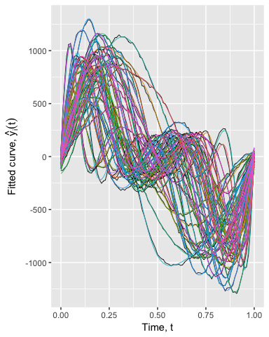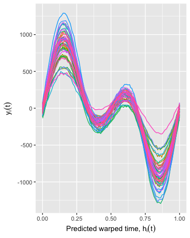

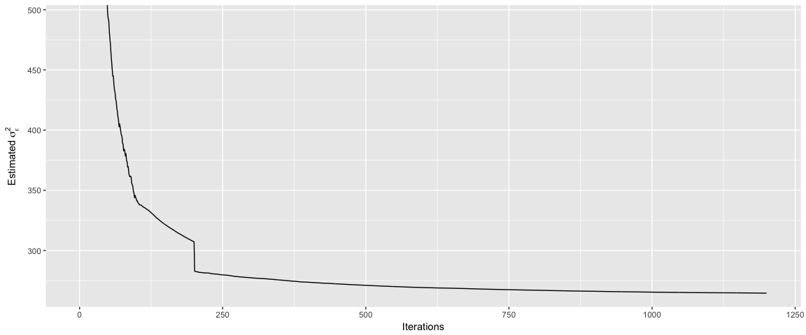

Clustering on phase variation
=============================

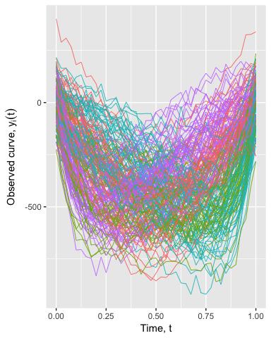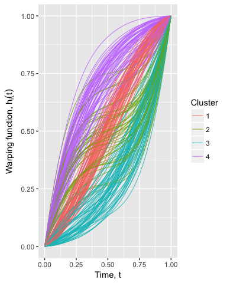

Fit mixture of warping function by SAEM
---------------------------------------

``` r
clust_out <- fsim_unimodal(
  y = mix_data$y,
  obs_time = mix_data$x,
  curve_id = mix_data$id,
  n_clust = 4,
  saem_control = control_saem(
    n_saem_iter = 2000,
    n_saem_burn = 200,
    n_mcmc_burn = 5,
    h_knots = seq(0, 1, length=5)
  ))
```

    ## [1] "Randomizing initial cluster labels..."
    ## Entering SAEM loop...
    ## 0.0%...5.0%...Initialize clustering with user inputs...
    ## cluster_size
    ##    43.0000
    ##    53.0000
    ##    48.0000
    ##    56.0000
    ## 
    ## p_clusters
    ##    0.2150
    ##    0.2650
    ##    0.2400
    ##    0.2800
    ## 
    ## 10.0%...15.0%...20.0%...25.0%...30.0%...35.0%...40.0%...45.0%...50.0%...55.0%...60.0%...65.0%...70.0%...75.0%...80.0%...85.0%...90.0%...95.0%...(Done)

``` r
flex_clust_out <- fsim_mixed_warped_curves(
  y = mix_data$y,
  obs_time = mix_data$x,
  curve_id = mix_data$id,
  n_clust = 4,
  saem_control = control_saem(
    n_saem_iter = 2000,
    n_saem_burn = 200,
    n_mcmc_burn = 5,
    h_knots = seq(0, 1, length=7),
    f_knots = seq(0, 1, length=3)
  ))
```

    ## [1] "Randomizing initial cluster labels..."
    ## Import parameters...
    ## Generate Cholesky centering matrix...
    ## Import data...
    ## Initialize basis evaluation matrices...
    ## Entering SAEM loop...
    ## 0.0%...5.0%...Initialize clustering with user inputs...
    ## cluster_size
    ##    59.0000
    ##    50.0000
    ##    52.0000
    ##    39.0000
    ## 
    ## p_clusters
    ##    0.2950
    ##    0.2500
    ##    0.2600
    ##    0.1950
    ## 
    ## 10.0%...15.0%...20.0%...25.0%...30.0%...35.0%...40.0%...45.0%...50.0%...55.0%...60.0%...65.0%...70.0%...75.0%...80.0%...85.0%...90.0%...95.0%...(Done)

    ##           pred_clust
    ## true_clust  1  2  3  4
    ##          1  0  0  0 49
    ##          2  0  0 41  0
    ##          3  0 54  1  2
    ##          4 50  0  2  1

    ## [1] 0.9206613

    ##           flex_pred_clust
    ## true_clust  1  2  3  4
    ##          1 49  0  0  0
    ##          2  0  0 40  1
    ##          3  3  0  1 53
    ##          4  9 43  1  0

    ## [1] 0.8072151

Fitted curves and registered curves
-----------------------------------

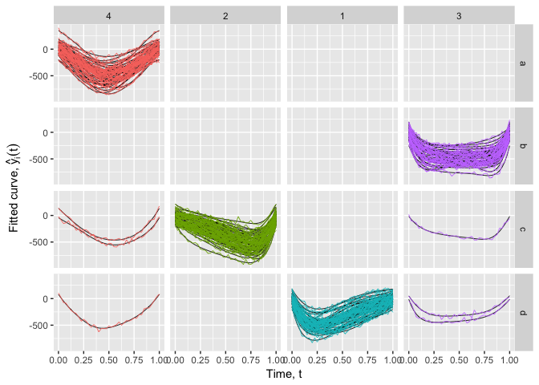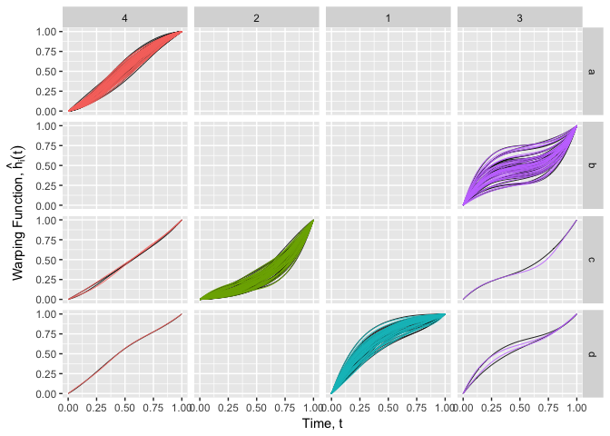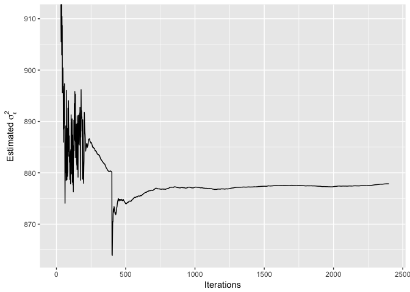

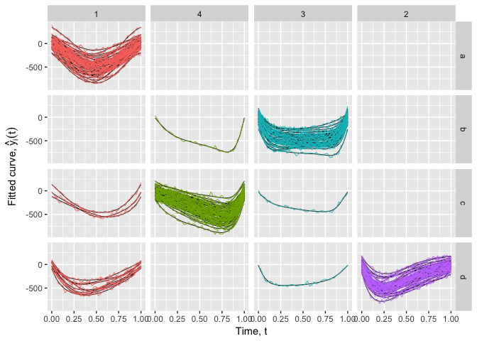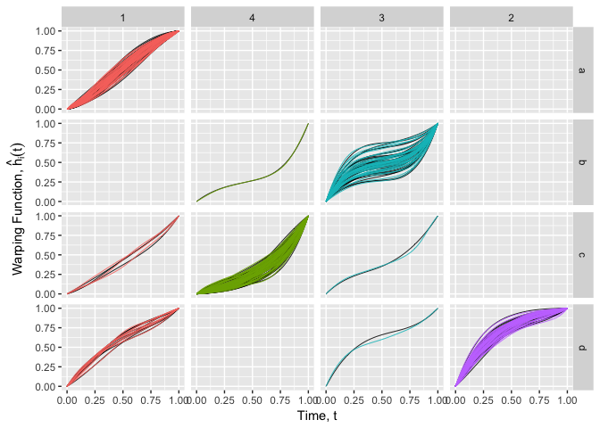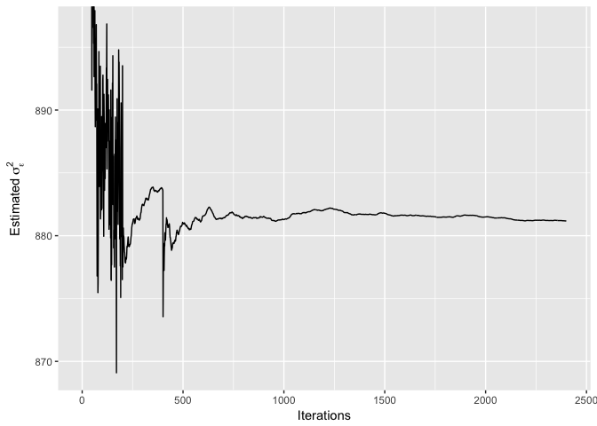
